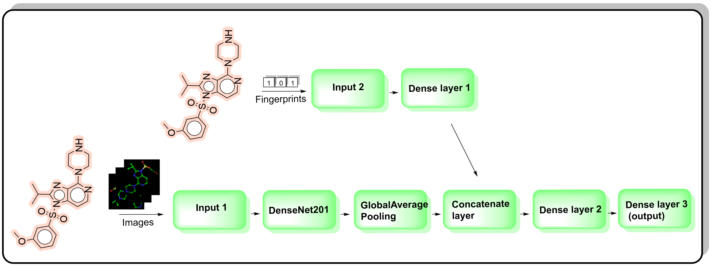

# CNNdock

CNNdock is a project demonstrating the utility of converting molecular docking outputs from Maestro Schrodinger into a Convolutional Neural Network (CNN) pipeline. This pipeline is used as a binary classifier for pharmacological activity against the 5-HT6 receptor.

---

## Workflow

I am proposing a hybrid Structure-Based and Ligand-Based Drug Design (SB-/LBDD) protocol.  
To enhance CNNdock's robustness, accuracy, and accessibility, I have developed a deep neural network with two inputs:

1. **Images** of docked compounds derived from the Maestro Schrodinger workspace.
2. **Molecular fingerprints**.

This integration of data provides complementary information, improving the model's predictive power.  
Additionally, I have accelerated the image generation process using a custom Python-based plugin for Maestro [1]. The plugin, originally implemented with `tkinter`, simplifies the workflow for generating these images.




---

## List of Content

1. **CNNdock_estimator.ipynb** - CNN classifier based on images and fingerprints.  
2. **Fps_estimator.ipynb** - Reference classifier based only on fingerprints.  
3. **CNNdock_maestro_plugin.py** - Python plugin for Maestro Schrodinger Suite (versions below 2024-4), used for taking screenshots of the workspace.  
4. **ChEMBL_parser.ipynb** - Code for parsing and initial preprocessing of chemical data to build the training dataset.
5. **Example_dataset** -  compressed folder (.zip) containing images of ligands after molecular docking, used to train the classifier.

---

## CNNdock_maestro_plugin: Installation and Usage

### Installation

1. Open Maestro and click the **Scripts** icon.  
2. In the pop-up window, select the **Install** icon.  
3. Specify the directory containing `CNNdock_maestro_plugin.py` and follow the prompts.

### Usage

Once installed, access the plugin by clicking **Scripts** and selecting the relevant option.  
Follow the on-screen instructions to generate images for the CNN pipeline.

---

## Dependencies

### CNNdock_maestro_plugin

The plugin uses Python libraries to interface with Maestro and requires certain dependencies to be installed. Ensure your environment meets the necessary requirements.

### CNNdock Classifier

The classifier generates Morgan fingerprints from SMILES strings using the open-source chemoinformatics library **RDKit** [2].  
Since RDKit is not a native Python library, we simplified the installation process by incorporating the following command at the top of the code:
```python
!pip install rdkit
```

---

## References
1.https://www.schrodinger.com/python-api/   
2.https://www.rdkit.org/docs/  
